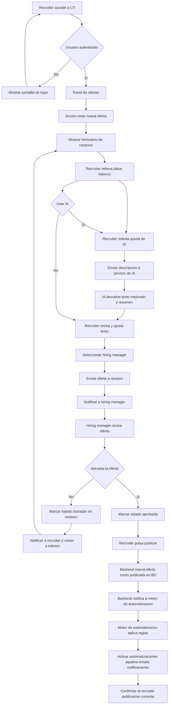
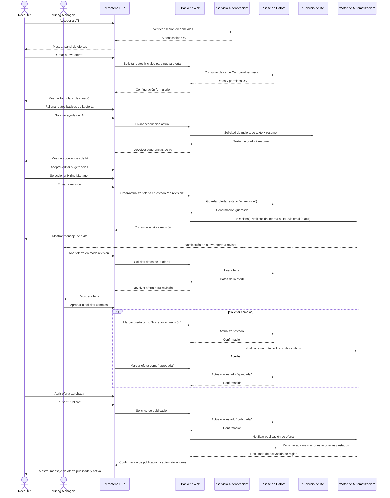
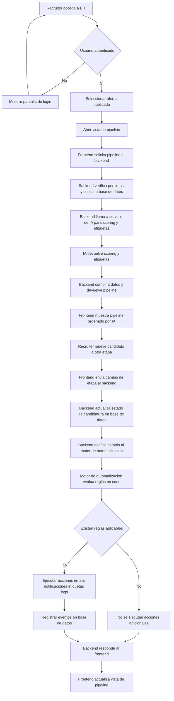
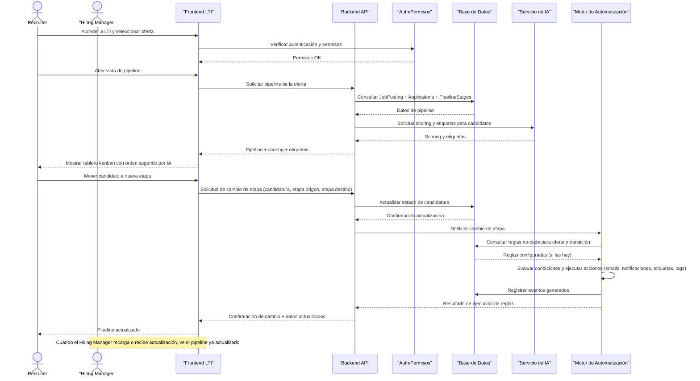
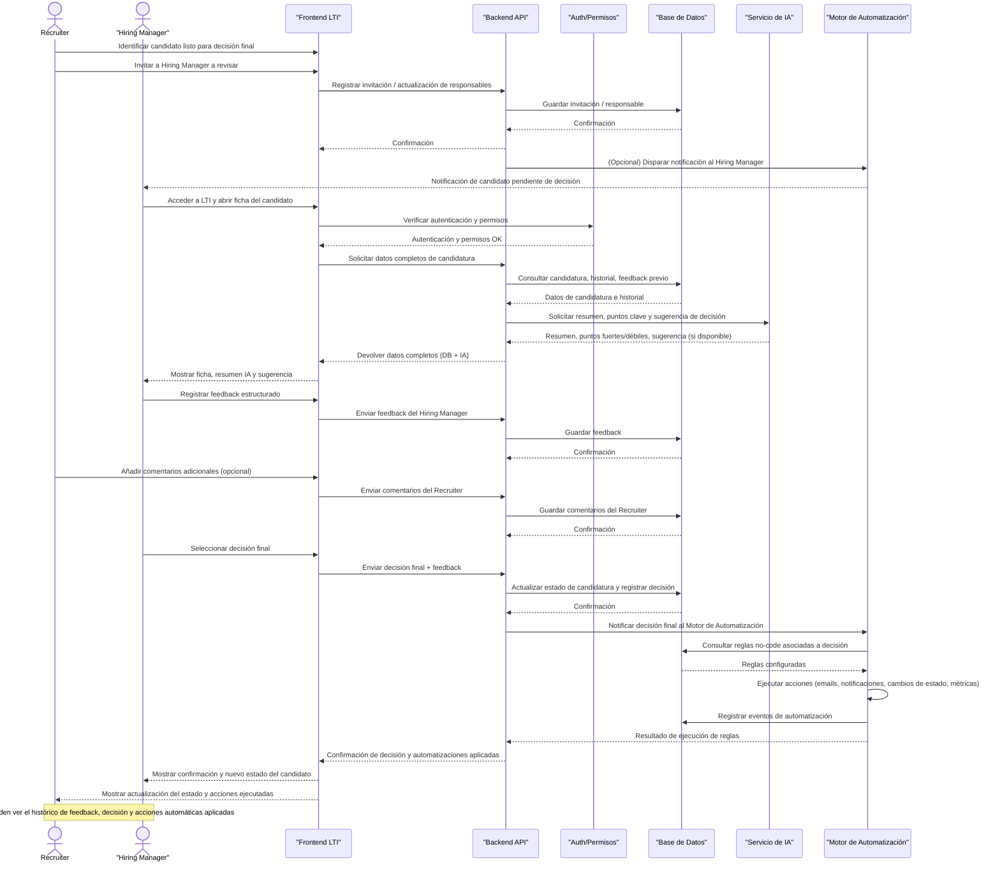
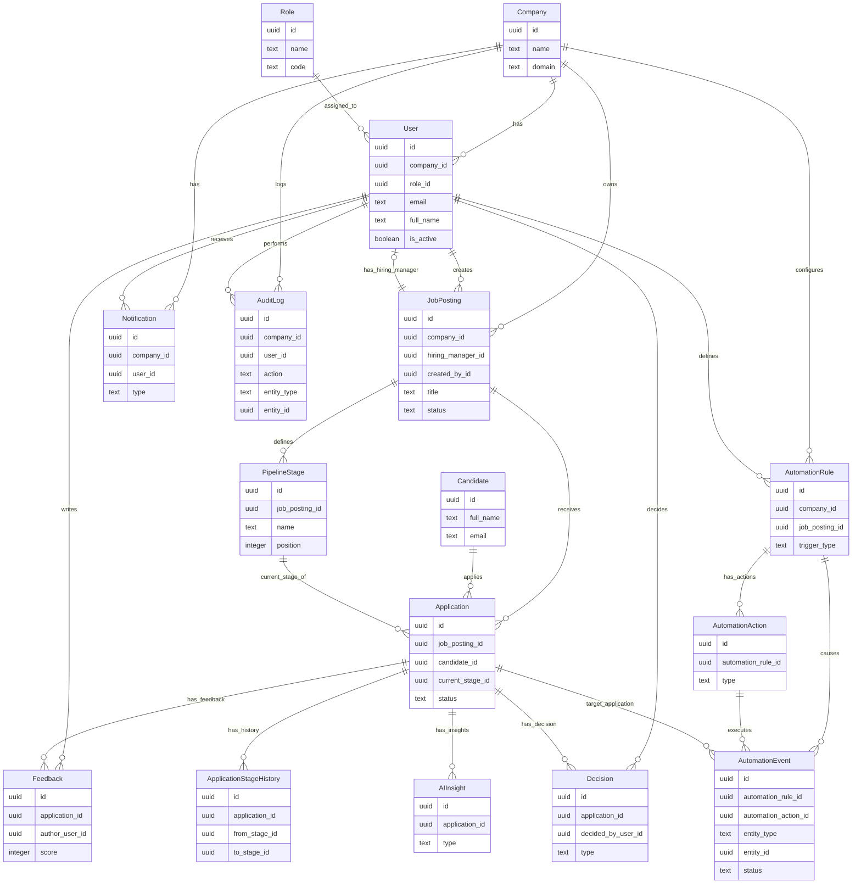
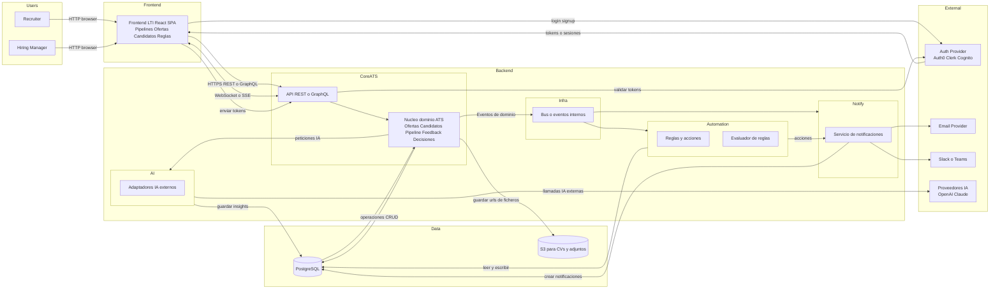
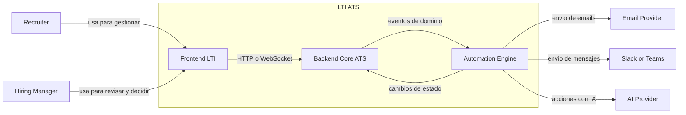
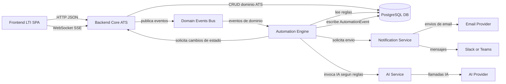

# LTI – Documento Maestro

> Documento maestro del proyecto LTI. Toda la información estratégica y de diseño se irá consolidando aquí siguiendo la estructura oficial de fases.

---

## FASE 1 — Análisis del Mercado

### 1. Análisis exhaustivo del mercado ATS

### 1.1 Evolución del mercado ATS

- **Primera generación (ATS 1.0 – compliance & tracking)**
  - Surgieron como respuesta a la necesidad de centralizar CVs y dar trazabilidad al proceso de selección.
  - Foco principal: registro de candidatos, cumplimiento legal, auditoría, reporting básico.
  - UX orientada a back-office de RRHH, poco pensada para managers y candidatos.
  - Procesos lineales: oferta → aplicación → screening → entrevistas → oferta.

- **Segunda generación (ATS 2.0 – SaaS, integraciones y employer branding)**
  - Modelo SaaS multi-tenant, uso cloud, despliegue más ágil.
  - Integración con job boards, LinkedIn, módulos de onboarding, HRIS.
  - Aparición de funcionalidades de employer branding (career sites, páginas de empleo, campañas).
  - Mejora en la experiencia de candidatos y en la colaboración básica con hiring managers.

- **Tercera generación incipiente (ATS 3.0 – data & workflow)**
  - Foco en analytics más avanzadas, dashboards configurables, pipelines customizables.
  - Automatizaciones tipo “if-this-then-that” (emails automáticos, cambios de etapa, recordatorios).
  - APIs más abiertas, marketplace de integraciones.
  - Primeras capas de IA: parsing de CVs, matching básico, ranking algorítmico.

- **Lo que falta (ATS 4.0 – LTI aspiracional)**
  - ATS como **motor de decisiones de talento**, no sólo sistema de registro.
  - Integración real de IA como **operador del proceso**, no adorno (clasificar, priorizar, redactar, resumir, predecir).
  - Automatización no-code estilo Zapier/Make, usable por recruiters sin soporte técnico.
  - Foco en colaboración fluida (recruiters, managers, candidatos) y en reducir trabajo manual, no sólo en organizarlo.

### 1.2 Tendencias actuales del mercado ATS

- **Convergencia ATS + HRIS + HR Ops**
  - Suites como BambooHR, Personio o HiBob integran ATS, core HR, performance y otros módulos.
  - Ventaja: datos unificados de ciclo de vida del empleado.
  - Desventaja: ATS suele ser un módulo más, no el foco principal; innovación va más lenta.

- **Especialización por segmento**
  - ATS enfocados a tech startups, retail, hospitality, high-volume hiring, staffing agencies.
  - Cada segmento demanda flujos y métricas muy específicos.

- **Más data, pero aún poca inteligencia accionable**
  - Dashboards de time-to-hire, source-of-hire, conversiones por etapa.
  - Poca prescripción (“qué priorizar hoy”, “qué cambiar en la estrategia de reclutamiento”).

- **IA como feature, no como core**
  - Parsing de CVs, matching keywords, generación de job descriptions.
  - Poca orquestación transversal: la IA no gestiona el proceso, sólo ayuda en puntos aislados.

- **Integraciones crecientes con ecosistema SaaS**
  - Calendarios, videoconferencia, herramientas de evaluación técnica, tests psicométricos, CRMs.
  - Aún existen fricciones significativas en implementación y mantenimiento de integraciones.

- **Candidate experience como factor de diferenciación**
  - Career sites más cuidados, procesos mobile-friendly, comunicacion más personalizada.
  - Pero muchos candidatos siguen sintiendo “agujero negro” y falta de transparencia.

### 1.3 Necesidades latentes no bien resueltas

- **Automatización avanzada accesible al recruiter medio**
  - Necesidad de construir flujos complejos sin programar (no-code real), conectando ATS con email, Slack, CRM, pruebas técnicas, etc.

- **Sistema de recomendación de talento completo**
  - No sólo para una vacante; también para:
    - Reutilización de candidatos para nuevas posiciones.
    - Movilidad interna.
    - Proyectos temporales o gigs internos.

- **Herramienta de trabajo diaria, no sólo repositorio**
  - Los recruiters viven en email, LinkedIn, Slack/Teams, hojas de cálculo.
  - El ATS debería ser el **hub operativo** y no un sistema pasivo que se actualiza “después”.

- **Insights conectados al negocio**
  - Impacto del hiring en revenue, churn, productividad, time-to-ramp.
  - Priorización de roles y esfuerzos de sourcing según impacto.

- **Orquestación inteligente de la colaboración**
  - Gestionar recordatorios, asignación de entrevistas, feedback y decisiones colectivas de forma fluida.

---

### 2. Dolor profundo por perfil: recruiters, managers, candidatos

### 2.1 Recruiters

- **Cansancio operativo y trabajo poco estratégico**
  - Data entry constante en el ATS.
  - Coordinación manual de entrevistas y comunicaciones.
  - Tiempo excesivo revisando CVs que podrían priorizarse automáticamente.

- **Flujos fragmentados entre herramientas**
  - ATS + email + LinkedIn + Slack + Excel + herramientas de evaluación.
  - Mucho “copiar/pegar” y pérdida de contexto.

- **Dificultad para priorizar el día a día**
  - Falta de un “inbox inteligente” que diga qué pipeline, candidato o manager necesita atención hoy.

- **Reporting manual y pesado**
  - Preparar informes para HR, C-level y negocio implica exportar, limpiar y combinar datos.

- **Falta de soporte real de IA**
  - La IA ayuda poco en las decisiones finas (a quién acelerar, a quién descartar, qué mensaje enviar).

### 2.2 Hiring managers

- **Sobrecarga y desinterés en el ATS**
  - Interfaces poco intuitivas, pensadas para recruiters.
  - Managers interactúan lo mínimo indispensable, y muchas decisiones pasan por canales alternativos.

- **Falta de visibilidad accionable**
  - Difícil ver rápidamente:
    - Estado real del proceso.
    - Riesgos (retrasos, falta de candidatos cualificados).
    - Qué decisiones deben tomar hoy.

- **Feedback pobre y desestructurado**
  - Formularios de feedback poco amigables.
  - Valoraciones subjetivas sin guías claras.

### 2.3 Candidatos

- **Sensación de “agujero negro”**
  - Aplican y no reciben feedback.
  - No saben en qué etapa están ni qué falta para avanzar.

- **Procesos tediosos y poco humanos**
  - Formularios largos, duplicación de datos.
  - Comunicaciones impersonales, copias de plantillas genéricas.

- **Falta de valor incluso cuando son rechazados**
  - Casi nunca reciben feedback que les ayude a mejorar.
  - Poca consideración por su tiempo y esfuerzo.

---

### 3. Evaluación crítica de ATS existentes

A continuación, un análisis de algunos players clave: Greenhouse, Lever, Workable, Teamtailor, BambooHR, Personio.

### 3.1 Greenhouse

- **Fortalezas**
  - Muy potente para organizaciones en crecimiento y enterprise.
  - Flujos de entrevista estructurados (scorecards, guías, kits de entrevista).
  - Buen ecosistema de integraciones y marketplace.
  - Fuerte enfoque en colaboración entre recruiters y managers.

- **Debilidades**
  - Curva de aprendizaje notable; interfaz compleja para usuarios ocasionales.
  - Automatizaciones limitadas fuera de casos estándar; se apoya mucho en integraciones externas.
  - IA presente, pero no como “orquestador” del proceso.

- **Gaps**
  - No-code automation nativo limitado.
  - Poca inteligencia prescriptiva para priorizar y sugerir acciones concretas.

### 3.2 Lever

- **Fortalezas**
  - Fuerte enfoque CRM de candidatos (pipeline global, reutilización de talento).
  - Buen equilibrio entre ATS y funcionalidades de outreach.
  - UX más moderna que muchos legacy.

- **Debilidades**
  - Puede sentirse complejo para equipos pequeños.
  - Dependencia de configuraciones avanzadas para sacar todo el valor.

- **Gaps**
  - IA no profundamente integrada en decisiones operativas diarias.
  - Automatización avanzada requiere soporte técnico/integraciones.

### 3.3 Workable

- **Fortalezas**
  - Orientado a SMB y mid-market, relativamente fácil de desplegar.
  - Buenas integraciones con job boards, herramientas de evaluación.
  - UI clara para reclutamiento generalista.

- **Debilidades**
  - Menos flexible para estructuras organizativas complejas.
  - Automations y workflows menos profundos que players enterprise.

- **Gaps**
  - Escasa capacidad no-code al estilo Zapier.
  - IA útil pero limitada en alcance (sourcing, anuncios, algo de screening).

### 3.4 Teamtailor

- **Fortalezas**
  - Muy fuerte en employer branding y candidate experience.
  - Career sites potentes, flujos de nurturing de candidatos.
  - Experiencia visualmente agradable.

- **Debilidades**
  - Analytics y reporting menos potentes que los heavyweights.
  - Menor foco en IA operativa y automatización compleja.

- **Gaps**
  - Faltan capacidades profundas de recomendación de talento.
  - Faltan herramientas avanzadas para managers y decisiones estratégicas.

### 3.5 BambooHR (módulo de reclutamiento)

- **Fortalezas**
  - Integración nativa con HRIS y ciclo de vida completo del empleado.
  - Conveniente para empresas que buscan un único proveedor para HR.

- **Debilidades**
  - ATS es un módulo más, no el foco principal del producto.
  - Menos profundidad funcional específica de reclutamiento.

- **Gaps**
  - IA casi inexistente o muy superficial en la parte de talento.
  - Automatización limitada comparado con herramientas dedicadas.

### 3.6 Personio

- **Fortalezas**
  - Suite HR completa para SMBs europeos.
  - ATS integrado con resto de procesos (onboarding, ausencias, nómina, etc.).

- **Debilidades**
  - ATS menos sofisticado que soluciones best-of-breed.
  - Flujos de automatización simplificados.

- **Gaps**
  - IA poco protagonista.
  - Escasa orientación a high-collaboration hiring y experiencias avanzadas para candidatos.

---

### 4. Oportunidades disruptivas para LTI

### 4.1 Qué no está resolviendo nadie de forma convincente

- **Automatización no-code profunda y usable por RRHH**
  - Construcción de flujos visuales tipo Zapier/Make directamente dentro del ATS.
  - Conectores preconfigurados con email, Slack/Teams, herramientas de evaluación, CRMs, HRIS, calendarios.

- **IA como operador del proceso, no como plugin**
  - IA que prioriza, resume, propone acciones, redacta comunicaciones y alerta de riesgos.
  - Capacidad de ejecutar “playbooks” inteligentes (ej.: campaña de reactivación de candidatos silver medalists).

- **Colaboración nativa en tiempo real**
  - Comentarios, menciones, decisiones y feedback integrados con Slack/Teams.
  - Vistas pensadas para managers: pocos clics, información clara, acciones rápidas.

- **Visión de talento unificada (interno y externo)**
  - Reutilización de candidatos previos.
  - Integración con HRIS para mapear skills internas y sugerir movilidad interna.

- **Candidate experience realmente transparente**
  - Portal para candidatos con estado actualizado del proceso.
  - Mensajes personalizados generados por IA, con supervisión humana.

### 4.2 Cómo diferenciarse desde el día 1

- **Mensaje de producto**: de ATS a **“Talent Orchestration Platform”**.
- **Propuesta central**: "Automatización no-code + IA operativa que reduce el trabajo manual del recruiter y mejora la experiencia de todos".
- **Feature flagships iniciales**:
  - Builder visual de flujos (drag & drop) con acciones preconfiguradas.
  - Inbox inteligente para recruiters y managers (qué hacer hoy, en qué orden y por qué).
  - Asistente de IA integrado en cada pantalla para redactar, resumir, priorizar y proponer siguientes pasos.

---

### 5. Segmentos de cliente óptimos

### 5.1 Segmentos posibles

1. **Startups y scale-ups tecnológicas (50–1000 empleados)**
   - Alto volumen de contratación en picos.
   - Equipos de People/HR pequeños pero sofisticados digitalmente.
   - Uso intensivo de SaaS (Slack, Notion, CRMs, etc.).

2. **Empresas mid-market con hiring distribuido (200–3000 empleados)**
   - Varios países/unidades de negocio.
   - Hiring managers con mucha carga operativa y poco tiempo.

3. **Agencias de recruiting y RPOs**
   - Viven del volumen y de la eficiencia operativa.
   - Procesos complejos, multi-cliente, con mucha customización.

4. **Sectores de high-volume hiring (retail, hospitality, logística)**
   - Gran cantidad de candidatos por posición.
   - Necesidad de screening y automatización intensivos.

### 5.2 Análisis comparativo rápido

- **Startups/scale-ups tech**
  - + Alta urgencia en eficiencia y rapidez.
  - + Mentalidad de early adopter.
  - − Presupuesto más limitado que enterprise, pero suficiente para SaaS bien justificado.

- **Mid-market distribuido**
  - + Necesitan colaboración y automatización a escala.
  - + Mas presupuesto.
  - − Procesos más rígidos, ciclos de venta más largos.

- **Agencias/RPOs**
  - + Enorme beneficio potencial de automatización.
  - − Requisitos muy específicos y heterogéneos por cliente.

- **High-volume hiring**
  - + Gran dolor en screening y experiencia del candidato.
  - − Frecuentemente muy sensibles a precio, con flujos muy custom.

### 5.3 Recomendación de segmentación inicial

- **Segmento primario recomendado**: *Startups y scale-ups tecnológicas (50–1000 empleados)*.
  - Razones:
    - Alta apertura a nuevas herramientas SaaS.
    - Fuerte uso de integraciones (Slack, ATS, HRIS, CRMs) donde LTI puede brillar.
    - Dolor claro en tiempo operativo de recruitment y coordinación con managers.

- **Segmento secundario**: *Agencias y RPOs seleccionadas*.
  - Como early adopters avanzados para validar el motor de automatización y IA operativa.

---

### 6. Posicionamiento estratégico de LTI

**Propuesta de posicionamiento (borrador):**

> LTI es la plataforma de orquestación de talento que combina automatización no-code y una IA operativa para reducir drásticamente el trabajo manual en reclutamiento, mejorar la colaboración con managers y ofrecer una experiencia transparente y humana a los candidatos.

Elementos clave del posicionamiento:

- **Automatización no-code como núcleo**, no como add-on.
- **IA integrada en el flujo de trabajo** (no sólo en features aisladas).
- **Foco en colaboración y experiencia de usuario** (recruiters, managers, candidatos).
- **Talento como grafo vivo**, no sólo como lista de candidatos por vacante.

---

### 7. Lista de problemas nítidos para guiar la V1

Estos problemas deben guiar los casos de uso, diseño funcional y arquitectura de LTI:

1. Los recruiters dedican demasiado tiempo a tareas manuales (data entry, coordinación, reporting) y muy poco a actividades estratégicas.
2. No existe una forma accesible (no-code) para que RRHH orqueste procesos complejos conectando ATS, email, Slack/Teams, herramientas de evaluación y HRIS.
3. Los ATS actuales no proporcionan un "inbox inteligente" que priorice acciones para recruiters y managers según impacto y urgencia.
4. La IA en los ATS es superficial: no actúa como copiloto operativo que clasifica candidatos, redacta mensajes, sugiere próximos pasos y detecta riesgos.
5. La colaboración con hiring managers es pobre: interfaces poco amigables, feedback tardío y decisiones repartidas entre múltiples canales.
6. La experiencia del candidato es opaca: no sabe en qué punto del proceso está ni recibe comunicación o feedback adecuados.
7. Los datos de talento están fragmentados (interno vs externo, ATS vs HRIS) y no se aprovechan para movilidad interna ni para reutilizar candidatos.
8. Los insights de reclutamiento se centran en reporting histórico y no en recomendaciones accionables conectadas al negocio.
9. Cambiar de ATS o integrarlo profundamente con el stack SaaS actual implica fricción alta, tiempos largos de implementación y costes ocultos.
10. No existe hoy una plataforma que combine de forma coherente: ATS + motor de automatización no-code + IA operativa + colaboración en tiempo real.

---

---

### 8. Síntesis y posicionamiento de LTI (cierre FASE 1)

**Resumen ejecutivo de la FASE 1:**

- El mercado ATS ha evolucionado desde sistemas de compliance y registro (ATS 1.0) hacia soluciones SaaS integradas con cierto nivel de automatización y analytics (ATS 2.0/3.0), pero sigue careciendo de una **IA verdaderamente operativa** y de **automatización no-code profunda** al alcance de RRHH.
- Recruiters, hiring managers y candidatos comparten una frustración común: procesos fragmentados, mucho trabajo manual, baja visibilidad y experiencias poco humanas.
- Los líderes actuales (Greenhouse, Lever, Workable, Teamtailor, BambooHR, Personio) resuelven bien partes del problema, pero dejan huecos claros en automatización avanzada, colaboración en tiempo real, explotación de datos de talento (interno/externo) y soporte inteligente a la toma de decisiones.

**Posicionamiento estratégico resultante:**

> LTI se posiciona como una **Talent Orchestration Platform**: una plataforma de orquestación de talento que combina automatización no-code y una IA operativa para convertir el ATS en el hub de trabajo diario de reclutadores y managers, reduciendo drásticamente el trabajo manual y ofreciendo una experiencia transparente y humana a los candidatos.

Elementos clave de este posicionamiento:

- **Automatización no-code como capa central**: LTI permite a equipos de RRHH diseñar y mantener flujos complejos (notificaciones, integraciones, recordatorios, campañas, playbooks) sin depender de IT.
- **IA operativa, no cosmética**: la IA ayuda a priorizar candidatos y procesos, genera comunicaciones, resume entrevistas, sugiere próximos pasos y alerta de riesgos en tiempo real.
- **Colaboración fluida en el stack real de trabajo**: integración nativa con Slack/Teams y otras herramientas para que managers y recruiters colaboren donde ya pasan su tiempo.
- **Talento como grafo vivo**: LTI entiende candidatos internos y externos de forma unificada, facilitando reutilización de talento, movilidad interna y decisiones más informadas.

**Enfoque base del producto (para fases posteriores):**

- Empezar enfocando LTI en **startups y scale-ups tecnológicas (50–1000 empleados)** y **algunas agencias/RPOs avanzadas**, donde el dolor de eficiencia y colaboración es mayor y la adopción de nuevas herramientas SaaS es más rápida.
- Construir desde el inicio sobre tres pilares funcionales que guiarán la V1:
  1. **Inbox inteligente** para recruiters y managers.
  2. **Builder de automatización no-code** integrado en el ATS.
  3. **Copiloto de IA** embebido en cada etapa del proceso de reclutamiento.

Esta síntesis cierra la FASE 1 y servirá como base directa para la FASE 2 (Descripción del Software), manteniendo coherencia en todas las fases posteriores.

---

## FASE 2 — Descripción del Software

### 2.1 Descripción breve de LTI

LTI es una **plataforma de orquestación de talento** que combina un ATS moderno con un motor de automatización no-code y una capa de IA operativa. Está diseñada para equipos de People/HR y hiring managers de **startups y scale-ups tecnológicas** (y, en una segunda fase, agencias/RPOs avanzadas) que necesitan reducir drásticamente el trabajo manual, coordinarse mejor y ofrecer una experiencia más transparente y humana a los candidatos.

En lugar de ser sólo un repositorio de candidatos y vacantes, LTI actúa como el **hub de trabajo diario** del equipo de reclutamiento: centraliza información, automatiza flujos entre herramientas (email, Slack/Teams, pruebas, HRIS) y proporciona recomendaciones inteligentes para priorizar acciones.

### 2.2 Valor añadido y ventajas competitivas

LTI se diferencia de los ATS actuales en varios ejes clave:

- **Automatización no-code como núcleo del producto**  
  Reclutadores pueden diseñar y mantener flujos complejos (notificaciones, integraciones, recordatorios, campañas de nurturing, reactivación de candidatos, coordinación con managers) mediante un builder visual tipo Zapier/Make, sin recurrir a IT ni a consultorías externas.

- **IA operativa integrada en el flujo de trabajo**  
  La IA no es un adorno puntual, sino un copiloto que:
  - Prioriza candidatos y procesos según probabilidad de éxito y riesgo de caída.
  - Resume CVs, entrevistas y feedback en pocos puntos accionables.
  - Genera y personaliza emails y mensajes a candidatos y managers.
  - Sugiere próximos pasos (mover de etapa, programar entrevistas, reactivar candidatos "silver medalists").

- **Experiencia de colaboración real para managers**  
  LTI reduce la fricción para hiring managers ofreciendo:
  - Un **inbox sencillo** con las decisiones que deben tomar hoy.
  - Integración con Slack/Teams para revisar candidatos, dejar feedback y aprobar/descartar sin abandonar sus herramientas habituales.

- **Visión unificada de talento interno y externo**  
  LTI está preparada para conectar con HRIS y otras fuentes para:
  - Reutilizar candidatos de procesos anteriores.
  - Identificar talento interno para nuevas vacantes.
  - Construir un grafo de skills y experiencias que soporte decisiones de movilidad interna.

En conjunto, estas ventajas competitivas permiten a LTI **atacar directamente los problemas nítidos identificados en la FASE 1**: exceso de trabajo manual, falta de automatización potente, IA superficial, mala colaboración con managers, experiencia opaca para candidatos y poca conexión entre datos de talento y decisiones de negocio.

### 2.3 Funciones principales de la V1

La V1 de LTI se centra en un conjunto de funciones núcleo que maximizan impacto con el mínimo producto viable, alineadas con los dolores prioritarios:

1. **Inbox inteligente para recruiters y managers**
   - Vista centralizada que muestra:
     - Candidatos que requieren acción inmediata (respuesta, programación de entrevista, decisión).
     - Procesos en riesgo (pocas aplicaciones, tiempos excesivos en una etapa, candidatos sin respuesta reciente).
   - Priorización basada en reglas + señales de IA.
   - Acciones rápidas (mover de etapa, enviar mensaje, asignar entrevistador) sin navegar por múltiples pantallas.

2. **Builder de automatización no-code (v1)**
   - Editor visual de flujos basado en disparadores y acciones del tipo:
     - "Cuando un candidato entra en etapa X" → "enviar mensaje Y" + "crear recordatorio para el manager".
     - "Cuando pasan N días sin actividad" → "enviar follow-up" o "escalar a recruiter".
   - Conectores iniciales:
     - Email (plantillas + personalización con IA).
     - Slack/Teams (notificaciones y resúmenes).
   - Objetivo: reducir tareas repetitivas (recordatorios, actualizaciones de estado, comunicaciones estándar).

3. **Copiloto de IA en el flujo de reclutamiento**
   - Asistente contextual dentro de LTI que permite:
     - Generar descripciones de rol y mensajes a candidatos a partir de pocos inputs.
     - Resumir CVs y entrevistas en bullet points alineados con el scorecard.
     - Proponer preguntas de entrevista y criterios de evaluación según el perfil.
   - Siempre bajo supervisión humana (revisión/edición antes de enviar o registrar).

4. **Gestión de pipeline ATS centrada en usabilidad**
   - Pipelines visuales por vacante, con arrastrar/soltar de candidatos entre etapas.
   - Vistas adaptadas a recruiters (detalle, filtros) y managers (resumen, decisiones rápidas).
   - Histórico básico de interacciones por candidato (mensajes, entrevistas, decisiones).

5. **Candidate experience básica pero elegante**
   - Comunicación más consistente:
     - Confirmación de recepción de candidatura.
     - Actualizaciones cuando cambian de etapa o son descartados.
   - Mensajes generados con ayuda de IA pero calibrados para sonar humanos y respetuosos.

6. **Reporting esencial orientado a acción**
   - Métricas clave mínimas para la V1:
     - Tiempo medio por etapa y por proceso.
     - Fuentes de candidatos y tasa de conversión básica.
     - Volumen y estado de procesos activos.
   - Enfoque en reportes que ayuden a responder: "¿Dónde estamos atascados?" y "¿Qué debemos priorizar?".

Estas funciones de la V1 no cubren todavía todo el potencial de LTI (como movilidad interna avanzada o integraciones profundas con HRIS y pruebas técnicas), pero establecen una base sólida alineada con el **posicionamiento de LTI como ATS + automatización no-code + IA operativa**, y preparan el terreno para las fases siguientes de diseño, modelo de datos y arquitectura.

---

## FASE 3 — Lean Canvas

| Bloque                | Contenido                                                                                                                                    |
|-----------------------|----------------------------------------------------------------------------------------------------------------------------------------------|
| **Problema**          | 1) Recruiters dedican demasiado tiempo a tareas manuales (data entry, coordinación, reporting). 2) Falta de priorización clara del trabajo diario y visibilidad de riesgos en los procesos. 3) Colaboración deficiente entre recruiters y hiring managers (feedback tardío y disperso). 4) Experiencia del candidato opaca (poca comunicación, estado del proceso poco claro). 5) ATS actuales con IA superficial y automatización limitada, poco integrados con el stack real (Slack/Teams, email, HRIS). |
| **Segmentos de clientes** | 1) Startups y scale-ups tecnológicas (50–1000 empleados) con equipos de People/HR pequeños pero digitales, hiring distribuido y fuerte uso de herramientas SaaS. 2) Agencias de recruiting y RPOs avanzadas que gestionan múltiples clientes y necesitan eficiencia extrema. 3) En una fase posterior, mid-market con hiring distribuido que requiera mayor nivel de automatización y colaboración. |
| **Propuesta de valor**| LTI es una **Talent Orchestration Platform** que convierte el ATS en el hub operativo del equipo de reclutamiento mediante **automatización no-code** y **IA operativa**, reduciendo drásticamente el trabajo manual, mejorando la colaboración con managers y ofreciendo una experiencia transparente y humana a los candidatos. |
| **Solución**          | 1) ATS centrado en un **inbox inteligente** que prioriza acciones para recruiters y managers según impacto y urgencia. 2) **Builder de automatización no-code** para orquestar flujos entre ATS, email y Slack/Teams sin necesidad de IT. 3) **Copiloto de IA** integrado en cada etapa (screening, generación de mensajes, resumen de CVs/entrevistas, sugerencia de próximos pasos). 4) Pipelines usables y reporting esencial orientado a detectar bloqueos y riesgos. |
| **Canales**           | 1) Venta directa a startups/scale-ups tech vía outbound selectivo y red de contactos (founders, Heads of People). 2) Marketing de contenido y presencia en comunidades HR/People y comunidades tech (Slack/LinkedIn). 3) Partnerships puntuales con consultoras de talento y RPOs que busquen una plataforma moderna para sus clientes. |
| **Métricas clave**    | 1) Reducción del tiempo medio de proceso y del tiempo en etapa crítica. 2) % de tareas automáticas vs manuales en el flujo de reclutamiento. 3) Tasa de respuesta de hiring managers (tiempo hasta el feedback). 4) NPS/satisfacción de recruiters y managers con la herramienta. 5) Tasa de actualización de estado para candidatos (disminución de "agujeros negros"). |
| **Estructura de costes** | 1) Desarrollo y mantenimiento del producto (equipo de ingeniería, producto y diseño). 2) Infraestructura cloud y costes de uso de modelos de IA/de terceros. 3) Costes de integraciones y soporte técnico (implementaciones, helpdesk). 4) Adquisición de clientes (marketing, ventas, partnerships). |
| **Flujo de ingresos** | 1) Modelo SaaS por suscripción, con pricing por número de empleados o plazas activas + número de asientos (recruiters/managers). 2) Posibles tiers (Starter para startups, Growth para scale-ups, Agency para RPOs). 3) Ingresos adicionales potenciales por servicios premium (onboarding avanzado, soporte prioritario, features avanzadas de IA/automatización). |
| **Ventaja injusta**   | 1) Diseño del producto desde cero alrededor de **automatización no-code + IA operativa**, no como añadidos a un ATS heredado. 2) Foco extremo en colaboración recruiter–manager mediante integraciones nativas con Slack/Teams e interfaces simples. 3) Capacidad de evolucionar el producto rápidamente para segmentos tech/early adopters, creando playbooks de automatización e IA basados en mejores prácticas reales de reclutamiento moderno. |

---

## FASE 4 — Casos de Uso Principales

## FASE 4.1 — Caso de Uso 1: Crear y publicar una oferta con automatizaciones e IA

### 4.1.1 Descripción estructurada del caso de uso

- **Nombre:** Crear y publicar una oferta con automatizaciones e IA
- **Actores principales:**
  - Recruiter (actor principal)
  - Hiring Manager (actor secundario, aprobador)
- **Actores de sistema / servicios involucrados:**
  - Frontend LTI
  - Backend API
  - Servicio de autenticación y autorización
  - Base de Datos (DB)
  - Servicio de IA
  - Motor de automatización no-code

#### Objetivo

Permitir que un recruiter cree una nueva oferta de trabajo, mejore su contenido con ayuda de IA, la someta a revisión del hiring manager y, tras su aprobación, la publique con las automatizaciones iniciales activadas para gestionar futuras candidaturas.

#### Precondiciones

- El recruiter está autenticado correctamente en LTI.
- El recruiter tiene permisos para crear ofertas para su empresa.
- Existe una entidad `Company` a la que pertenece el recruiter.

#### Postcondiciones

- La oferta se almacena en la Base de Datos en estado **"publicada"**.
- La oferta queda visible para recibir candidaturas.
- Las automatizaciones iniciales asociadas a la oferta se han configurado y activado (reglas de confirmación a candidatos, pipeline inicial, notificaciones internas, etc.).
- El hiring manager queda asociado como responsable de la oferta.

#### Flujo principal

1. El recruiter accede a LTI e inicia sesión (si no estaba autenticado).
2. Desde el panel de ofertas, el recruiter selecciona la opción **"Crear nueva oferta"**.
3. El Frontend solicita al Backend la información necesaria (permisos, datos de empresa) y muestra el formulario de creación de oferta.
4. El recruiter introduce los datos básicos de la oferta (título, descripción, requisitos, ubicación, tipo de contrato, etc.).
5. El recruiter solicita ayuda de IA para mejorar el texto de la oferta.
6. El Backend envía la descripción actual al Servicio de IA.
7. El Servicio de IA devuelve una versión mejorada de la oferta y un resumen del rol.
8. El recruiter revisa las sugerencias de IA y:
   - acepta completamente las sugerencias, o
   - combina sugerencias y texto propio.
9. El recruiter selecciona al Hiring Manager responsable de la oferta.
10. El recruiter guarda la oferta como borrador y la envía a revisión del Hiring Manager.
11. El Hiring Manager recibe una notificación (por ejemplo, vía email o Slack) y accede a la pantalla de revisión de la oferta.
12. El Hiring Manager revisa el contenido de la oferta.
13. Si está conforme, el Hiring Manager aprueba la oferta.
14. Tras la aprobación, el recruiter (o el propio Hiring Manager, según permisos) pulsa **"Publicar"**.
15. El Backend actualiza el estado de la oferta a **"publicada"** en la Base de Datos.
16. El Backend notifica al Motor de Automatización que la oferta ha sido publicada.
17. El Motor de Automatización evalúa las reglas no-code asociadas a la publicación de ofertas y activa las automatizaciones configuradas (pipeline inicial, mensajes de confirmación, notificaciones internas, etc.).
18. El sistema confirma al recruiter que la oferta ha sido publicada y está lista para recibir candidatos.

#### Flujos alternativos

- **A1. Oferta rechazada por el Hiring Manager**
  1. En el paso 13, el Hiring Manager marca la oferta como **"solicitar cambios"** en lugar de aprobarla.
  2. El Backend actualiza el estado de la oferta a **"borrador en revisión"**.
  3. El recruiter recibe una notificación indicando que el Hiring Manager solicita cambios.
  4. El recruiter vuelve a la pantalla de edición de la oferta, ajusta el contenido y repite el flujo desde el paso 10.

- **A2. IA no sugiere mejoras válidas o el recruiter no desea aplicarlas**
  1. En el paso 7, la respuesta de la IA no aporta mejoras relevantes o el recruiter decide mantener el texto original.
  2. El recruiter ignora las sugerencias de la IA y continúa con el flujo desde el paso 9.

- **A3. Error en Motor de Automatización**
  1. En el paso 17, si el Motor de Automatización no está disponible o devuelve un error, el Backend registra el incidente.
  2. La oferta permanece en estado **"publicada"**, pero se marcan las automatizaciones como "pendientes de activación".
  3. El sistema puede notificar al equipo de soporte y mostrar un aviso al recruiter.

---

### 4.1.2 Diagrama de flujo (flowchart)



---

### 4.1.3 Diagrama de secuencia (sequenceDiagram)



## FASE 4.2 — Caso de Uso 2: Gestionar el pipeline de candidatos con IA y reglas no-code

### 4.2.1 Descripción estructurada del caso de uso

- **Nombre:** Gestionar el pipeline de candidatos con asistencia de IA y reglas no-code
- **Actores principales:**
  - Recruiter (actor principal)
- **Actores secundarios:**
  - Hiring Manager (consulta y feedback del pipeline)
- **Actores de sistema / servicios involucrados:**
  - Frontend LTI
  - Backend API
  - Servicio de autenticación y permisos (Auth)
  - Base de Datos (DB)
  - Servicio de IA
  - Motor de automatización no-code

#### Objetivo

Permitir que el recruiter gestione el pipeline de candidatos de una oferta (visualizar, priorizar y mover candidatos entre etapas) con asistencia de IA para scoring/etiquetado y con automatizaciones no-code que se disparan cuando cambian las etapas.

#### Precondiciones

- El recruiter ha iniciado sesión en LTI y está autenticado.
- El recruiter tiene permisos sobre la oferta y su pipeline.
- La oferta está creada y publicada.
- Existen candidaturas asociadas a esa oferta en la Base de Datos.

#### Postcondiciones

- Las etapas de los candidatos en el pipeline quedan actualizadas según los movimientos realizados por el recruiter.
- Las automatizaciones definidas en el Motor de Automatización (si existen) se han evaluado y ejecutado para los cambios de etapa.
- La información utilizada por la IA (scoring, etiquetas) puede reflejar los cambios más recientes.
- El Hiring Manager, al acceder al pipeline, ve el estado actualizado de los candidatos.

#### Flujo principal

1. El recruiter accede a LTI e inicia sesión (si no lo estaba previamente).
2. Desde el panel de ofertas, selecciona una oferta publicada.
3. El recruiter abre la vista de **pipeline de candidatos** para esa oferta.
4. El Frontend solicita al Backend el pipeline completo (candidatos, etapas actuales y metadatos necesarios).
5. El Backend verifica permisos con el servicio de Auth.
6. El Backend consulta la Base de Datos para obtener `JobPosting`, `Applications` y `PipelineStage` relevantes.
7. El Backend llama al Servicio de IA, proporcionando información de la oferta y de los candidatos, para obtener:
   - scoring de cada candidato,
   - etiquetas sugeridas (ej.: "match alto", "senior", "riesgo").
8. El Servicio de IA devuelve al Backend el scoring y las etiquetas por candidato.
9. El Backend combina los datos de la DB con los resultados de IA y responde al Frontend.
10. El Frontend muestra el pipeline en formato tablero (kanban): columnas por etapa, tarjetas por candidato, orden sugerido por el scoring de IA.
11. El recruiter selecciona un candidato y lo arrastra a otra columna/etapa (por ejemplo, de "Screening" a "Entrevista técnica").
12. El Frontend envía al Backend una solicitud de actualización de etapa para la candidatura (antigua etapa, nueva etapa, identificador de candidatura).
13. El Backend valida que el cambio de etapa es permitido y actualiza el registro correspondiente en la Base de Datos.
14. El Backend notifica al Motor de Automatización que se ha producido un cambio de etapa para esa candidatura.
15. El Motor de Automatización consulta las reglas no-code definidas para esa oferta y esa transición concreta (de etapa X a etapa Y).
16. Si existen reglas aplicables, el Motor de Automatización ejecuta las acciones asociadas: por ejemplo, enviar un email al candidato, notificar al Hiring Manager, añadir etiquetas o registrar eventos.
17. El Motor de Automatización registra en la DB los eventos generados (logs, cambios de estado adicionales, notificaciones).
18. El Motor de Automatización devuelve al Backend el resultado de la ejecución de reglas.
19. El Backend envía al Frontend la confirmación de la operación junto con los datos actualizados de la candidatura.
20. El Frontend actualiza visualmente el pipeline para el recruiter.

#### Flujos alternativos

- **B1. No hay reglas no-code configuradas para la transición**
  1. En el paso 15, el Motor de Automatización no encuentra reglas asociadas al cambio de etapa.
  2. No se ejecutan acciones adicionales.
  3. El flujo continúa desde el paso 19 (actualización y confirmación al recruiter).

- **B2. Hiring Manager visualiza el pipeline en paralelo**
  1. El Hiring Manager tiene abierta la vista de pipeline de la misma oferta.
  2. Cuando el recruiter mueve candidatos, el sistema puede:
     - enviar actualizaciones en tiempo casi real al frontend del Hiring Manager, o
     - reflejar cambios cuando el Hiring Manager recarga la vista.
  3. En cualquier caso, el Hiring Manager ve el pipeline actualizado tras el cambio.

- **B3. Error en la actualización de etapa o en el Motor de Automatización**
  1. En el paso 13 o 16 se produce un error (DB no disponible, Motor de Automatización no responde).
  2. El Backend revierte o marca el cambio como no aplicado y registra el incidente.
  3. El Frontend muestra un mensaje de error al recruiter indicando que no se ha podido completar la operación.

---

### 4.2.2 Diagrama de flujo (flowchart)



---

### 4.2.3 Diagrama de secuencia (sequenceDiagram)



## FASE 4.3 — Caso de Uso 3: Evaluación colaborativa recruiter–manager y decisión final con IA

### 4.3.1 Descripción estructurada del caso de uso

- **Nombre:** Evaluación colaborativa recruiter–manager y decisión final con IA
- **Actores principales:**
  - Hiring Manager (responsable de la decisión final)
- **Actores secundarios:**
  - Recruiter (coordina el proceso y garantiza documentación)
- **Actores de sistema / servicios involucrados:**
  - Frontend LTI
  - Backend API
  - Auth/Permisos
  - Base de Datos (DB)
  - Servicio de IA
  - Motor de automatización no-code

#### Objetivo

Permitir que Hiring Manager y Recruiter colaboren en la evaluación final de un candidato en etapa avanzada, apoyándose en IA para obtener un resumen y recomendación, dejando feedback estructurado y registrando una decisión final que, a su vez, dispare automatizaciones no-code (emails, actualizaciones de estado, notificaciones, métricas).

#### Precondiciones

- El Hiring Manager y el Recruiter han iniciado sesión en LTI y están autenticados.
- Ambos tienen permisos de acceso a la oferta y a la candidatura (según Auth/Permisos).
- El candidato ha alcanzado una etapa en la que se requiere decisión final (por ejemplo, tras varias entrevistas).
- La candidatura existe en la Base de Datos con datos asociados (CV, entrevistas, feedback previo).

#### Postcondiciones

- La decisión final sobre el candidato queda registrada en la Base de Datos (por ejemplo: "Enviar oferta", "Rechazar", "Seguir en proceso").
- Se han ejecutado las automatizaciones configuradas para esa decisión (emails al candidato, notificaciones internas, actualización de estado, métricas).
- El pipeline y las métricas vinculadas a esa oferta reflejan la nueva situación del candidato.

#### Flujo principal

1. El Recruiter identifica que un candidato está listo para evaluación final (según etapa del pipeline o criterios internos).
2. El Recruiter invita al Hiring Manager a revisar la candidatura (si no está ya asignado), lo que genera una notificación (email o in-app).
3. El Hiring Manager recibe la notificación y accede a LTI.
4. Desde su vista de tareas o la lista de candidatos, el Hiring Manager abre la ficha del candidato.
5. El Frontend solicita al Backend los datos completos de la candidatura (CV, historial de etapas, entrevistas, feedback previo).
6. El Backend valida permisos con Auth/Permisos para el Hiring Manager.
7. El Backend consulta la Base de Datos para obtener toda la información relevante de la candidatura y de la oferta.
8. El Backend llama al Servicio de IA para que, a partir de los datos de la candidatura (CV, entrevistas, feedback), genere:
   - un resumen del perfil,
   - puntos fuertes y debilidades,
   - una sugerencia de decisión (opcional), como "candidato altamente recomendado".
9. El Servicio de IA devuelve al Backend el resumen, los puntos clave y la sugerencia de decisión.
10. El Backend combina información de la DB e IA y la envía al Frontend.
11. El Frontend muestra al Hiring Manager:
    - datos del candidato,
    - resumen y puntos clave generados por IA,
    - sugerencia de decisión,
    - feedback previo disponible,
    - sección para dejar feedback y decisión.
12. El Hiring Manager deja feedback estructurado (por ejemplo, puntuación, comentarios, recomendaciones).
13. El Recruiter, si lo desea, añade también comentarios o matices sobre el contexto del proceso.
14. El Hiring Manager selecciona una decisión final (por ejemplo: "Enviar oferta", "Rechazar", "Seguir en proceso").
15. El Frontend envía la decisión final y el feedback al Backend.
16. El Backend actualiza el estado de la candidatura en la Base de Datos y registra la decisión y el feedback asociados.
17. El Backend informa al Motor de Automatización de la decisión final tomada.
18. El Motor de Automatización consulta las reglas no-code definidas para esa decisión final (por ejemplo, reglas distintas para "Oferta", "Rechazo" o "Seguir en proceso").
19. El Motor de Automatización ejecuta las acciones configuradas (emails al candidato, notificaciones internas, cambios adicionales de estado, actualización de métricas) y registra los eventos en la DB.
20. El Motor de Automatización devuelve al Backend el resultado de la ejecución de reglas.
21. El Backend confirma al Frontend que la decisión y las acciones asociadas se han procesado correctamente.
22. El Frontend muestra al Hiring Manager y al Recruiter la confirmación y el nuevo estado del candidato.

#### Flujos alternativos

- **C1. El Hiring Manager no está disponible o retrasa la evaluación**
  1. El Recruiter ve que la decisión final está pendiente y que el Hiring Manager no ha completado su feedback.
  2. El Recruiter utiliza LTI para enviar recordatorios (por ejemplo, a través de notificaciones o email), ya sea manualmente o mediante una automatización previamente configurada.
  3. Hasta que el Hiring Manager complete la evaluación, la candidatura permanece en estado "pendiente de decisión" y no se dispara ninguna automatización final.

- **C2. La IA no puede generar sugerencia de decisión**
  1. En el paso 8, el Servicio de IA no puede generar una sugerencia (por falta de datos, error temporal, etc.).
  2. El Backend informa al Frontend de que sólo dispone de resumen parcial o de que no hay recomendación.
  3. El Hiring Manager realiza la evaluación y toma la decisión manualmente, sin recomendación de IA.
  4. El flujo continúa desde el paso 12.

- **C3. Error al registrar la decisión o al ejecutar automatizaciones**
  1. En el paso 16 o 19 se produce un error (por ejemplo, fallo en la Base de Datos o en el Motor de Automatización).
  2. El Backend registra el incidente y, si procede, revierte o marca como incompleta la operación.
  3. El Frontend muestra un mensaje de error al Hiring Manager y/o Recruiter indicando que la decisión no ha podido completarse totalmente.
  4. El sistema puede ofrecer reintentar más tarde o escalar a soporte.

---

### 4.3.2 Diagrama de flujo (flowchart)

```mermaid
flowchart TD
    A[Recruiter identifica candidato listo para decision final] --> B[Invitar a hiring manager a revisar]
    B --> C[Enviar notificacion a hiring manager]
    C --> D[Hiring manager accede a LTI]
    D --> E{Usuario autenticado y con permisos}
    E -->|No| F[Mostrar error o solicitar login o permisos]
    F --> D
    E -->|Si| G[Abrir ficha del candidato]
    G --> H[Frontend solicita datos al backend]
    H --> I[Backend consulta base de datos para candidatura e historial]
    I --> J[Backend llama a IA para generar resumen y sugerencia]
    J --> K[IA devuelve resumen puntos clave y sugerencia]
    K --> L[Backend envia datos combinados de DB e IA al frontend]
    L --> M[Frontend muestra ficha con resumen IA]

    M --> N[Hiring manager deja feedback estructurado]
    N --> O[Recruiter puede añadir comentarios]
    O --> P[Hiring manager selecciona decision final]
    P --> Q[Frontend envia decision al backend]
    Q --> R[Backend actualiza estado y decision en base de datos]
    R --> S[Backend notifica decision al motor de automatizacion]
    S --> T[Motor de automatizacion consulta reglas no code para la decision]
    T --> U[Motor de automatizacion ejecuta acciones emails notificaciones metricas]
    U --> V[Motor de automatizacion registra eventos en base de datos]
    V --> W[Motor de automatizacion devuelve resultado al backend]
    W --> X[Backend confirma exito al frontend]
    X --> Y[Frontend muestra confirmacion y nuevo estado a hiring manager y recruiter]

    %% Alternativa: Hiring manager no responde
    B --> C1[Hiring manager no revisa a tiempo]
    C1 --> C2[Recruiter envia recordatorios manual o automatico]
    C2 --> C

    %% Alternativa: IA no devuelve recomendacion
    J --> Z{IA devuelve sugerencia}
    Z -->|No| Z1[Continuar sin sugerencia de IA]
    Z1 --> L
    Z -->|Si| K
```



---

### 4.3.3 Diagrama de secuencia (sequenceDiagram)



---

## FASE 5 — Modelo de Datos de LTI

### 5.1 Entidades principales

A continuación se listan las entidades principales del dominio de LTI, orientadas a soportar los casos de uso de creación/publicación de ofertas, gestión de pipeline con IA y reglas no-code, y evaluación colaborativa con decisión final y automatizaciones:

- **Company**: Organización cliente que utiliza LTI.
- **User**: Usuario del sistema asociado a una Company (recruiter, hiring manager, admin, etc.).
- **Role**: Rol lógico del usuario dentro de la compañía (RECRUITER, HIRING_MANAGER, ADMIN, etc.).
- **JobPosting**: Oferta de empleo publicada por una Company.
- **Candidate**: Persona candidata, independiente de las ofertas a las que aplica.
- **Application**: Candidatura de un Candidate a una JobPosting.
- **PipelineStage**: Etapas posibles del pipeline dentro de una JobPosting (ej.: Applied, Screening, Interview, Offer, Rejected).
- **ApplicationStageHistory**: Historial de cambios de etapa para una Application.
- **Feedback**: Evaluaciones y comentarios estructurados realizados sobre una Application (por recruiters y hiring managers).
- **Decision**: Registro explícito de una decisión final o intermedia sobre una Application (ej.: Enviar oferta, Rechazar, Seguir en proceso).
- **AutomationRule**: Regla no-code que define condiciones (evento, filtros) y se asocia a una Company y opcionalmente a una JobPosting.
- **AutomationAction**: Acciones concretas que pertenecen a una AutomationRule (enviar email, notificar, cambiar etapa, etc.).
- **AutomationEvent**: Registro de la ejecución de una regla/acción de automatización sobre una entidad concreta (por ejemplo, una Application).
- **AIInsight**: Resultado de análisis de IA sobre una Application (resumen, puntos fuertes/débiles, recomendaciones).
- **Notification**: Notificación interna enviada a uno o varios Users (in-app, email, Slack, etc.).
- **AuditLog**: Registro de eventos relevantes de cambio en el sistema a efectos de auditoría.

### 5.2 Atributos por entidad

#### 5.2.1 Company

| Campo        | Tipo        | Descripción                                              | Notas         |
|--------------|-------------|----------------------------------------------------------|---------------|
| id           | uuid        | Identificador único de la empresa                       | PK            |
| name         | text        | Nombre de la empresa                                    |               |
| domain       | text        | Dominio principal de la empresa (ej.: acme.com)         | Único opcional|
| created_at   | timestamptz | Fecha de creación del registro                          |               |
| updated_at   | timestamptz | Fecha de última actualización                           |               |

#### 5.2.2 Role

| Campo      | Tipo        | Descripción                                   | Notas |
|------------|-------------|-----------------------------------------------|-------|
| id         | uuid        | Identificador único del rol                  | PK    |
| name       | text        | Nombre interno del rol                       | Único |
| code       | text        | Código del rol (ej.: RECRUITER, HIRING_MANAGER, ADMIN) | Único |
| created_at | timestamptz | Fecha de creación                            |       |
| updated_at | timestamptz | Fecha de última actualización                 |       |

#### 5.2.3 User

| Campo        | Tipo        | Descripción                                              | Notas                      |
|--------------|-------------|----------------------------------------------------------|----------------------------|
| id           | uuid        | Identificador único del usuario                         | PK                         |
| company_id   | uuid        | Referencia a la Company a la que pertenece              | FK → Company.id            |
| email        | text        | Email del usuario                                       | Único dentro de Company    |
| full_name    | text        | Nombre completo                                         |                            |
| role_id      | uuid        | Rol principal del usuario                               | FK → Role.id               |
| is_active    | boolean     | Indica si la cuenta está activa                         |                            |
| created_at   | timestamptz | Fecha de creación                                       |                            |
| updated_at   | timestamptz | Fecha de última actualización                            |                            |

#### 5.2.4 JobPosting

| Campo           | Tipo        | Descripción                                                          | Notas                              |
|-----------------|-------------|----------------------------------------------------------------------|------------------------------------|
| id              | uuid        | Identificador único de la oferta                                    | PK                                 |
| company_id      | uuid        | Empresa propietaria de la oferta                                    | FK → Company.id                    |
| title           | text        | Título de la oferta                                                 |                                    |
| description     | text        | Descripción larga de la oferta                                      |                                    |
| location        | text        | Ubicación (remoto, ciudad, país, etc.)                              |                                    |
| employment_type | text        | Tipo de contrato (ej.: FULL_TIME, PART_TIME, CONTRACT)              | Se puede normalizar en un enum     |
| status          | text        | Estado de la oferta (DRAFT, UNDER_REVIEW, PUBLISHED, CLOSED)        | Enum lógico                        |
| hiring_manager_id | uuid      | Usuario responsable principal de la oferta                          | FK → User.id                       |
| created_by_id   | uuid        | Recruiter que creó la oferta                                        | FK → User.id                       |
| published_at    | timestamptz | Fecha de publicación de la oferta                                   | Nullable                           |
| created_at      | timestamptz | Fecha de creación                                                   |                                    |
| updated_at      | timestamptz | Fecha de última actualización                                       |                                    |

#### 5.2.5 Candidate

| Campo        | Tipo        | Descripción                                     | Notas |
|--------------|-------------|-------------------------------------------------|-------|
| id           | uuid        | Identificador único del candidato              | PK    |
| full_name    | text        | Nombre completo                                |       |
| email        | text        | Email de contacto                              |       |
| phone        | text        | Teléfono de contacto                           |       |
| location     | text        | Ubicación del candidato                        |       |
| resume_url   | text        | URL al CV o documento adjunto                  |       |
| linkedin_url | text        | URL al perfil de LinkedIn                      |       |
| created_at   | timestamptz | Fecha de creación                              |       |
| updated_at   | timestamptz | Fecha de última actualización                  |       |

#### 5.2.6 Application

| Campo             | Tipo        | Descripción                                                     | Notas                                  |
|-------------------|-------------|-----------------------------------------------------------------|----------------------------------------|
| id                | uuid        | Identificador único de la candidatura                          | PK                                     |
| job_posting_id    | uuid        | Referencia a la oferta a la que aplica                         | FK → JobPosting.id                     |
| candidate_id      | uuid        | Referencia al candidato                                        | FK → Candidate.id                      |
| current_stage_id  | uuid        | Etapa actual del pipeline para esta candidatura                | FK → PipelineStage.id                  |
| status            | text        | Estado general de la candidatura (ACTIVE, WITHDRAWN, HIRED, REJECTED) | Enum lógico                    |
| source            | text        | Fuente de la candidatura (JOB_BOARD, REFERRAL, DIRECT, AGENCY) | Enum lógico                            |
| applied_at        | timestamptz | Fecha en la que el candidato aplicó                            |                                        |
| created_at        | timestamptz | Fecha de creación del registro                                 |                                        |
| updated_at        | timestamptz | Fecha de última actualización                                  |                                        |

#### 5.2.7 PipelineStage

| Campo          | Tipo        | Descripción                                                      | Notas                              |
|----------------|-------------|------------------------------------------------------------------|------------------------------------|
| id             | uuid        | Identificador único de la etapa                                 | PK                                 |
| job_posting_id | uuid        | Oferta a la que pertenece esta etapa                            | FK → JobPosting.id                 |
| name           | text        | Nombre de la etapa (Applied, Screening, Interview, Offer, etc.) |                                    |
| position       | integer     | Orden de la etapa en el pipeline                                |                                    |
| is_final       | boolean     | Indica si es una etapa final (ej.: Hired, Rejected)             |                                    |
| created_at     | timestamptz | Fecha de creación                                               |                                    |
| updated_at     | timestamptz | Fecha de última actualización                                    |                                    |

#### 5.2.8 ApplicationStageHistory

| Campo            | Tipo        | Descripción                                                           | Notas                                   |
|------------------|-------------|-----------------------------------------------------------------------|-----------------------------------------|
| id               | uuid        | Identificador único del evento de cambio de etapa                    | PK                                      |
| application_id   | uuid        | Candidatura afectada                                                 | FK → Application.id                     |
| from_stage_id    | uuid        | Etapa origen (nullable si es la primera)                             | FK → PipelineStage.id, nullable         |
| to_stage_id      | uuid        | Nueva etapa                                                           | FK → PipelineStage.id                   |
| changed_by_user_id | uuid      | Usuario que realizó el cambio (habitualmente un recruiter)           | FK → User.id                            |
| changed_at       | timestamptz | Fecha y hora del cambio                                               |                                         |
| reason           | text        | Motivo del cambio (opcional)                                         | Nullable                                |

#### 5.2.9 Feedback

| Campo           | Tipo        | Descripción                                                       | Notas                            |
|-----------------|-------------|-------------------------------------------------------------------|----------------------------------|
| id              | uuid        | Identificador único del feedback                                 | PK                               |
| application_id  | uuid        | Candidatura evaluada                                             | FK → Application.id              |
| author_user_id  | uuid        | Usuario que deja el feedback (recruiter, hiring manager)        | FK → User.id                     |
| score           | integer     | Puntuación numérica (ej.: 1–5)                                   | Nullable                         |
| comments        | text        | Comentarios detallados                                           | Nullable                         |
| created_at      | timestamptz | Fecha de creación del feedback                                   |                                  |
| updated_at      | timestamptz | Fecha de última actualización                                    |                                  |

#### 5.2.10 Decision

| Campo           | Tipo        | Descripción                                                        | Notas                            |
|-----------------|-------------|--------------------------------------------------------------------|----------------------------------|
| id              | uuid        | Identificador único de la decisión                                | PK                               |
| application_id  | uuid        | Candidatura sobre la que se toma la decisión                     | FK → Application.id              |
| decided_by_user_id | uuid     | Usuario que toma la decisión (normalmente el Hiring Manager)      | FK → User.id                     |
| type            | text        | Tipo de decisión (OFFER, REJECT, ADVANCE, HOLD)                  | Enum lógico                      |
| notes           | text        | Comentarios adicionales sobre la decisión                         | Nullable                         |
| decided_at      | timestamptz | Fecha y hora en la que se toma la decisión                        |                                  |

#### 5.2.11 AutomationRule

| Campo           | Tipo        | Descripción                                                                                 | Notas                                      |
|-----------------|-------------|---------------------------------------------------------------------------------------------|--------------------------------------------|
| id              | uuid        | Identificador único de la regla de automatización                                          | PK                                         |
| company_id      | uuid        | Empresa a la que pertenece la regla                                                         | FK → Company.id                             |
| job_posting_id  | uuid        | Oferta específica a la que aplica la regla (nullable si es global para la Company)         | FK → JobPosting.id, nullable                |
| name            | text        | Nombre descriptivo de la regla                                                              |                                            |
| trigger_type    | text        | Tipo de disparador (ON_STAGE_CHANGE, ON_DECISION, ON_APPLICATION_CREATED, etc.)            | Enum lógico                                 |
| trigger_config  | jsonb       | Configuración del disparador (ej.: de_etapa, a_etapa, tipos de decisión)                    |                                            |
| is_active       | boolean     | Indica si la regla está activa                                                              |                                            |
| created_by_id   | uuid        | Usuario que creó la regla                                                                   | FK → User.id                                |
| created_at      | timestamptz | Fecha de creación                                                                           |                                            |
| updated_at      | timestamptz | Fecha de última actualización                                                                |                                            |

#### 5.2.12 AutomationAction

| Campo          | Tipo        | Descripción                                                                     | Notas                         |
|----------------|-------------|---------------------------------------------------------------------------------|-------------------------------|
| id             | uuid        | Identificador único de la acción                                               | PK                            |
| automation_rule_id | uuid    | Regla a la que pertenece la acción                                             | FK → AutomationRule.id        |
| type           | text        | Tipo de acción (SEND_EMAIL, SEND_NOTIFICATION, UPDATE_STAGE, UPDATE_METRICS)  | Enum lógico                   |
| config         | jsonb       | Configuración específica de la acción (plantilla de email, destinatarios, etc.)|                               |
| position       | integer     | Orden de ejecución de la acción dentro de la regla                             |                               |

#### 5.2.13 AutomationEvent

| Campo              | Tipo        | Descripción                                                                 | Notas                                   |
|--------------------|-------------|-----------------------------------------------------------------------------|-----------------------------------------|
| id                 | uuid        | Identificador único del evento de automatización                           | PK                                      |
| automation_rule_id | uuid        | Regla que se ejecutó                                                       | FK → AutomationRule.id                  |
| automation_action_id | uuid      | Acción concreta que se ejecutó (nullable si el evento es a nivel de regla) | FK → AutomationAction.id, nullable      |
| entity_type        | text        | Tipo de entidad afectada (APPLICATION, JOB_POSTING, COMPANY)               |                                        |
| entity_id          | uuid        | Identificador de la entidad afectada                                       |                                        |
| status             | text        | Estado de la ejecución (SUCCESS, FAILED)                                   | Enum lógico                             |
| error_message      | text        | Mensaje de error en caso de fallo                                          | Nullable                                |
| executed_at        | timestamptz | Momento de la ejecución                                                    |                                         |

#### 5.2.14 AIInsight

| Campo           | Tipo        | Descripción                                                                 | Notas                             |
|-----------------|-------------|-----------------------------------------------------------------------------|-----------------------------------|
| id              | uuid        | Identificador único del análisis de IA                                     | PK                                |
| application_id  | uuid        | Candidatura analizada                                                      | FK → Application.id               |
| type            | text        | Tipo de insight (SUMMARY, STRENGTHS_WEAKNESSES, DECISION_RECOMMENDATION)  | Enum lógico                       |
| payload         | jsonb       | Contenido del análisis (texto, estructura de puntos, scoring, etc.)        |                                   |
| model_version   | text        | Versión del modelo de IA utilizado                                         | Nullable                          |
| created_at      | timestamptz | Fecha de creación del insight                                              |                                   |

#### 5.2.15 Notification

| Campo          | Tipo        | Descripción                                                        | Notas                            |
|----------------|-------------|--------------------------------------------------------------------|----------------------------------|
| id             | uuid        | Identificador único de la notificación                            | PK                               |
| company_id     | uuid        | Empresa a la que se dirige la notificación                        | FK → Company.id                  |
| user_id        | uuid        | Usuario destinatario                                               | FK → User.id                     |
| type           | text        | Tipo de notificación (IN_APP, EMAIL, SLACK, WEBHOOK)              | Enum lógico                      |
| title          | text        | Título breve de la notificación                                   |                                  |
| message        | text        | Cuerpo del mensaje                                                 |                                  |
| metadata       | jsonb       | Datos adicionales (enlaces, IDs de entidades relacionadas, etc.)  | Nullable                         |
| is_read        | boolean     | Indica si el usuario ha marcado la notificación como leída        |                                  |
| created_at     | timestamptz | Fecha de creación                                                  |                                  |

#### 5.2.16 AuditLog

| Campo          | Tipo        | Descripción                                                        | Notas                            |
|----------------|-------------|--------------------------------------------------------------------|----------------------------------|
| id             | uuid        | Identificador único del evento de auditoría                       | PK                               |
| company_id     | uuid        | Empresa asociada al evento                                        | FK → Company.id                  |
| user_id        | uuid        | Usuario que originó el evento (nullable si es evento del sistema) | FK → User.id, nullable           |
| action         | text        | Acción realizada (CREATE_JOB, UPDATE_APPLICATION, RUN_AUTOMATION) |                                  |
| entity_type    | text        | Tipo de entidad afectada                                          |                                  |
| entity_id      | uuid        | Identificador de la entidad afectada                              |                                  |
| payload        | jsonb       | Datos adicionales del cambio                                      | Nullable                         |
| created_at     | timestamptz | Fecha del evento                                                  |                                  |

### 5.3 Relaciones entre entidades

- **Company – User**: una Company tiene muchos Users (1:N). Cada User pertenece a una única Company.
- **Company – JobPosting**: una Company tiene muchas JobPostings (1:N). Cada JobPosting pertenece a una Company.
- **Company – AutomationRule**: una Company puede tener muchas AutomationRules (1:N), algunas específicas de JobPosting y otras globales.
- **Company – Notification / AuditLog**: una Company tiene muchas Notifications y registros de AuditLog (1:N).
- **Role – User**: un Role puede estar asignado a muchos Users (1:N). Cada User tiene un rol principal (aunque en el futuro podría ampliarse a multirol vía tabla intermedia).
- **User – JobPosting**: un User puede ser creador de muchas JobPostings y/o Hiring Manager de varias (1:N). Cada JobPosting referencia a un hiring_manager_id y created_by_id.
- **JobPosting – PipelineStage**: una JobPosting tiene muchas PipelineStages (1:N) que definen su pipeline.
- **JobPosting – Application**: una JobPosting tiene muchas Applications (1:N). Cada Application referencia a exactamente una JobPosting.
- **Candidate – Application**: un Candidate puede tener muchas Applications (1:N). Cada Application pertenece a un Candidate.
- **Application – PipelineStage**: una Application referencia su PipelineStage actual vía current_stage_id (N:1 respecto a PipelineStage).
- **Application – ApplicationStageHistory**: una Application tiene muchos eventos de ApplicationStageHistory (1:N) que almacenan el historial de etapas.
- **Application – Feedback**: una Application tiene muchos Feedbacks (1:N), tanto de recruiters como de hiring managers.
- **Application – Decision**: una Application puede tener ninguna o varias Decisions (1:N), aunque normalmente habrá una decisión final relevante.
- **Application – AIInsight**: una Application puede tener muchos AIInsights (1:N) generados en distintas fases (screening, post-entrevista, decisión final).
- **AutomationRule – AutomationAction**: una AutomationRule tiene muchas AutomationActions (1:N).
- **AutomationRule – AutomationEvent**: una AutomationRule puede tener muchos AutomationEvents (1:N) que registran ejecuciones.
- **AutomationAction – AutomationEvent**: una AutomationAction puede estar asociada a muchos AutomationEvents (1:N) cuando se ejecuta.
- **Application / JobPosting / Company – AutomationEvent**: AutomationEvent referencia el tipo e id de entidad afectada (por ejemplo, una Application) mediante (entity_type, entity_id).
- **User – Feedback / Decision / AuditLog / Notification**: un User puede ser autor de muchos Feedbacks, Decisions, eventos de AuditLog y destinatario de muchas Notifications (1:N).

Estas relaciones permiten:

- Crear y publicar ofertas (`JobPosting`) asociadas a una `Company`, con responsables (`User`) y etapas (`PipelineStage`).
- Gestionar pipelines de candidatos (`Application`, `PipelineStage`, `ApplicationStageHistory`) con cambios de etapa y automatizaciones (`AutomationRule`, `AutomationAction`, `AutomationEvent`).
- Soportar evaluación colaborativa (`Feedback`, `Decision`) enriquecida con análisis de IA (`AIInsight`) y accionada por reglas de automatización configurables.

### 5.4 Diagrama ER en Mermaid



---

## FASE 6 — Diseño de sistema a alto nivel

### 6.1 Visión general de la arquitectura

Para la fase inicial de LTI (MVP serio pero aún en modo startup) se propone un **monolito modular backend** desplegado como un único servicio en producción, acompañado de un **frontend SPA** y algunos servicios gestionados externos (Auth, almacenamiento, proveedores de IA). Internamente, el monolito se organiza siguiendo principios de **arquitectura hexagonal (Ports & Adapters)** y **bounded contexts lógicos**, de forma que en el futuro las partes más críticas puedan separarse en servicios independientes sin reescribir todo el sistema.

Elementos clave de esta visión:

- **Frontend LTI (React + TypeScript)** como SPA que consume APIs del backend (REST/GraphQL) y mantiene sesiones de tiempo casi real mediante **WebSockets/Socket.io** o **SSE** para la actualización del pipeline, comentarios y notificaciones.
- **Backend LTI (Node.js + TypeScript)** como monolito modular que implementa:
  - **Core ATS** (ofertas, candidatos, candidaturas, pipeline, feedback, decisiones).
  - **Módulo de Automatización** (motor de reglas no code, definición y ejecución de flujos).
  - **Módulo de IA/Insights** (orquestación hacia proveedores de IA externos, cacheo de resultados, control de costes).
  - **Módulo de Notificaciones** (email, in-app, integraciones Slack/Teams en futuras iteraciones).
  - **Módulo de Observabilidad y Auditoría** (logs, métricas, auditoría funcional).
- **Base de datos PostgreSQL** accesible desde el backend mediante **Prisma**, modelada según la FASE 5 (Company, User, Role, JobPosting, Candidate, Application, PipelineStage, AutomationRule, AutomationEvent, AIInsight, etc.).
- **Proveedor externo de autenticación** (Auth0/Clerk/Cognito) encargado de gestionar identidad, login, tokens JWT/OIDC y multi-tenant básico (por dominio o claims), que el backend usa para aplicar autorización a nivel de dominio.
- **Servicio de IA orquestador** inicialmente implementado como un **módulo interno del monolito** (lógica de integración con OpenAI/Claude y otros proveedores) pero expuesto como un “servicio” a nivel lógico (puerto de dominio). Este módulo se puede extraer a un microservicio dedicado cuando el volumen de llamadas de IA crezca.
- **Motor de automatización no-code** residiendo dentro del monolito como un subsistema con su propio dominio (AutomationRule, AutomationAction, AutomationEvent) y con una **interfaz basada en eventos de dominio** emitidos desde el Core ATS.
- **Almacenamiento de ficheros en S3** (o servicio equivalente) utilizado por el backend para guardar CVs, adjuntos y otros documentos pesados.

La comunicación principal es **sincrónica vía HTTP** entre Frontend y Backend, complementada con **comunicación asíncrona basada en eventos internos** (inicialmente en memoria o con una cola ligera tipo Redis) entre el Core ATS y el Motor de Automatización/Notificaciones. Esto permite desacoplar la ejecución de reglas y notificaciones del flujo online del usuario.

Esta arquitectura equilibra:

- **Rapidez de desarrollo y simplicidad operativa** (monolito modular desplegado en ECS/Fargate o similar).
- **Claridad de dominios** gracias a la separación interna en módulos/bounded contexts.
- **Capacidad de evolución** a servicios separados (Automation Engine, AI Service, Notifications) sin ruptura de APIs internas, porque ya se trabaja conceptualmente con puertos/adaptadores y eventos de dominio.

### 6.2 Componentes principales y responsabilidades

En esta sección se describen los componentes lógicos principales del sistema y sus responsabilidades.

#### 6.2.1 Frontend Web LTI (SPA React + TypeScript)

- Implementa la **UI principal** de LTI:
  - pipeline visual tipo kanban para cada `JobPosting` y sus `Applications`.
  - formularios de creación/edición de ofertas (`JobPosting`).
  - fichas de candidato (`Candidate` + `Application`).
  - pantallas de feedback y decisión (`Feedback`, `Decision`).
  - panel de configuración del **builder no-code** de reglas (`AutomationRule`, `AutomationAction`).
- Gestiona la sesión del usuario y la integración con el proveedor de Auth (login redirigido, uso de tokens).
- Consumo de APIs expuestas por el Backend (REST/GraphQL) para todas las operaciones de dominio.
- Suscripción a actualizaciones en tiempo casi real mediante Socket.io/SSE para:
  - cambios de estado en el pipeline.
  - nuevas notificaciones.
  - cambios en feedback/decisiones relevantes.

#### 6.2.2 Backend LTI – Core ATS

- Implementa el **dominio principal ATS** sobre PostgreSQL/Prisma:
  - gestión de `Company`, `User`, `Role`.
  - gestión de ofertas (`JobPosting`) y su ciclo de vida (DRAFT, UNDER_REVIEW, PUBLISHED, CLOSED).
  - gestión de candidatos (`Candidate`) y candidaturas (`Application`).
  - pipeline (`PipelineStage`, `ApplicationStageHistory`).
  - feedback (`Feedback`) y decisiones (`Decision`).
- Expone **APIs REST/GraphQL** para el frontend y para potenciales integraciones futuras.
- Aplica reglas de negocio del dominio ATS, incluyendo validación de cambios de etapa y restricciones por rol.
- Emite **eventos de dominio internos** (p.ej. `ApplicationStageChanged`, `DecisionFinalized`, `JobPostingPublished`) que son consumidos por el Motor de Automatización y el módulo de Notificaciones.
- Implementa una capa de autorización basada en claims del token de Auth (empresa, rol, scopes) y los datos de dominio (ej.: un Hiring Manager sólo puede ver ofertas/candidaturas de su `Company`).

#### 6.2.3 Motor de Automatización (Automation Engine)

- Subsistema dentro del backend monolito encargado de:
  - almacenar y gestionar reglas (`AutomationRule`) y acciones (`AutomationAction`).
  - subscribirse a eventos de dominio (p.ej. cambios de etapa, creación de candidaturas, decisiones finales).
  - evaluar reglas activas ante cada evento.
  - ejecutar acciones asociadas (`AutomationEvent`):
    - envíos de email.
    - notificaciones internas.
    - cambios adicionales de estado (p.ej. mover automáticamente a otra etapa).
    - actualización de métricas o registros en `AuditLog`.
- Ofrece APIs al frontend para:
  - configurar reglas y flujos no-code (builder visual).
  - activar/desactivar reglas.
  - visualizar logs de ejecución (`AutomationEvent`).
- Internamente, su lógica se implementa como un módulo con puertos/adaptadores, de manera que, si se decide extraerlo a un servicio independiente, el impacto sea mínimo.

#### 6.2.4 Servicio de IA (AI Orchestrator)

- Módulo especializado dentro del backend que:
  - normaliza el acceso a proveedores de IA (OpenAI, Claude, etc.).
  - implementa casos de uso de IA soportados en FASE 4:
    - mejora de descripciones de ofertas.
    - resúmenes de CVs y entrevistas.
    - scoring/priorización de candidatos.
    - sugerencias de decisión final.
  - persiste los resultados relevantes en `AIInsight` cuando tiene sentido.
- Define puertos de dominio como `GenerateJobDescription`, `ScoreApplications`, `SummarizeCandidate`, `SuggestDecision`, que pueden ser invocados por el Core ATS.
- Gestiona aspectos técnicos de IA:
  - selección de modelo.
  - manejo de timeouts y reintentos.
  - control y observabilidad de costes.
- Desde el punto de vista de arquitectura, se trata como un “servicio lógico” listo para ser separado en un microservicio si el volumen lo exige.

#### 6.2.5 Módulo de Notificaciones

- Responsable de generar y enviar:
  - notificaciones internas (`Notification` in-app).
  - emails transaccionales (via proveedor externo SMTP/SendGrid/Mailgun).
  - en el futuro, mensajes a Slack/Teams.
- Se integra con el Motor de Automatización (acciones de tipo `SEND_NOTIFICATION`, `SEND_EMAIL`).
- Proporciona APIs al frontend para listar notificaciones pendientes, marcarlas como leídas, etc.

#### 6.2.6 Base de datos PostgreSQL + Prisma

- Implementa el modelo relacional definido en FASE 5.
- Prisma actúa como **capa de acceso a datos** (repositorios) detrás de puertos de dominio en la arquitectura hexagonal.
- Soporta multi-tenant lógico (a nivel de `Company`) mediante filtros sistemáticos en todas las consultas.

#### 6.2.7 Almacenamiento de ficheros (S3)

- Guarda CVs, documentos adjuntos y otros ficheros grandes.
- El backend gestiona URLs firmadas y metadatos asociados.
- Se integra en el flujo de candidatos (`Candidate.resume_url`) y, en el futuro, como entrada para análisis de IA.

#### 6.2.8 Proveedor de autenticación externo (Auth0/Clerk/Cognito)

- Encargado de:
  - registro y login de usuarios.
  - recuperación de contraseña, MFA (si se habilita).
  - emisión de tokens JWT/OIDC con claims de identidad y rol.
- El backend confía en el proveedor de Auth para la autenticación y aplica autorización fina a nivel de dominio.

### 6.3 Patrones arquitectónicos y decisiones clave

#### 6.3.1 Monolito modular para el MVP

- Se elige un **monolito modular** para la fase inicial porque:
  - reduce la complejidad operativa (un único despliegue backend en ECS/Fargate).
  - simplifica el desarrollo del equipo pequeño (un único repositorio/backend con módulos bien definidos).
  - permite cambios funcionales rápidos mientras el producto busca encaje problema-solución.
- La modularidad interna (Core ATS, Automatización, IA, Notificaciones) evita el “big ball of mud” típico de muchos monolitos y prepara el terreno para extraer servicios cuando existan necesidades claras de escalado o de dominio.

#### 6.3.2 Arquitectura hexagonal / ports & adapters en el backend

- El backend implementa **puertos de dominio** para:
  - repositorios (acceso a PostgreSQL vía Prisma).
  - servicios externos (Auth, IA, email, Slack/Teams, S3).
  - canales de entrada (HTTP REST/GraphQL, WebSocket, workers de eventos internos).
- Las ventajas:
  - el dominio ATS (lógica de procesos de oferta, pipeline, feedback, decisiones) se mantiene independiente de detalles infra.
  - facilita pruebas unitarias de dominio sin depender de la DB o de proveedores externos.
  - permite cambiar proveedores (p.ej. de OpenAI a otro) sin reescribir la lógica del negocio.

#### 6.3.3 Event-driven interno para automatizaciones y auditoría

- Los eventos de dominio (`JobPostingPublished`, `ApplicationStageChanged`, `DecisionFinalized`, etc.) son el mecanismo central para:
  - disparar reglas de automatización.
  - generar entradas de auditoría (`AuditLog`).
  - enviar notificaciones (`Notification`).
- Inicialmente, los eventos pueden publicarse en un **bus en memoria** o mediante una cola ligera como **Redis Streams**; esto mantiene la complejidad baja pero ya introduce una interfaz asíncrona clara.
- Cuando el volumen crezca, el mismo modelo de eventos permitirá migrar a colas/streams más robustos (Kafka, SNS/SQS, etc.) y/o extraer el Automation Engine como servicio independiente.

#### 6.3.4 Bounded contexts lógicos

Se identifican varios **bounded contexts** dentro del monolito:

- **Core ATS**: ofertas, candidatos, candidaturas, pipeline, feedback, decisiones, reporting básico.
- **Automatización**: reglas, acciones, eventos de automatización, logs de ejecución.
- **IA/Insights**: análisis y recomendaciones generadas por IA, asociadas a `Application` y otros objetos.
- **Notificaciones y Comunicación**: notificaciones in-app, emails, integraciones con Slack/Teams.
- **Identidad y Organización**: `Company`, `User`, `Role` y permisos.

Cada contexto tiene sus propias entidades y servicios de dominio, conectados entre sí mediante eventos y APIs internas bien definidas.

#### 6.3.5 Evolución hacia una arquitectura distribuida

La arquitectura propuesta permite una evolución gradual hacia microservicios cuando sea necesario:

- **Automation Engine** puede extraerse a un servicio independiente que consuma eventos de dominio desde una cola externa y escriba resultados/`AutomationEvent` en la base de datos compartida o en su propia base.
- **AI Orchestrator** puede convertirse en un servicio separado para aislar latencias y gestionar de forma independiente escalado, cuotas y seguridad respecto a proveedores de IA.
- **Notifications** puede separarse para manejar volúmenes altos de envío (emails, Slack, etc.).

En todos los casos, la separación se hace sobre **interfaces ya existentes** (puertos y eventos), reduciendo el riesgo de refactorizaciones masivas.

### 6.4 Diagrama de arquitectura (Mermaid)



La arquitectura descrita es coherente con el modelo de datos de la FASE 5 y con los casos de uso de la FASE 4, y proporciona una base realista para una startup: **rápida de implementar como MVP**, pero preparada para evolucionar hacia una solución más distribuida y robusta a medida que LTI crezca.

---

## FASE 7 — Diagrama C4 del Automation Engine

### 7.1 System Context

El sistema LTI es una plataforma ATS SaaS B2B que combina gestión de ofertas, candidatos y pipelines con un **motor de automatización no-code** y una **capa de IA operativa**. Dentro de este sistema, el **Automation Engine** actúa como el “sistema nervioso” que escucha eventos del dominio ATS (publicación de ofertas, cambios de etapa, decisiones finales) y ejecuta acciones configuradas por negocio (emails, notificaciones, cambios de estado, actualización de métricas, invocación de servicios externos).

En el contexto global del sistema:

- **Recruiters** y **Hiring Managers** utilizan el **Frontend LTI** para trabajar con ofertas, candidatos y pipelines.
- Sus acciones en el Frontend se traducen en operaciones sobre el **Backend Core ATS**, que persiste información en **PostgreSQL** y emite **eventos de dominio** cuando ocurren cambios relevantes.
- El **Automation Engine** se sitúa dentro del backend LTI, suscrito a esos eventos de dominio. Cada evento se contrasta con las reglas configuradas (`AutomationRule`, `AutomationAction`), y si alguna aplica, el motor ejecuta las acciones correspondientes.
- Algunas acciones se materializan en sistemas externos (envío de emails, mensajes a Slack/Teams) a través del **Notification Service** y proveedores externos. Otras generan registros de auditoría, actualizaciones adicionales de estado o disparan procesos que pueden implicar al **AI Service**.

En resumen, el Automation Engine no es un sistema aislado, sino un componente clave dentro de LTI que conecta el **dominio ATS** con **acciones automatizadas** hacia el resto del ecosistema.



### 7.2 Container View

A nivel de contenedores, LTI se compone de varios bloques lógicos que cooperan para soportar el motor de automatización:

- **Frontend LTI (SPA)** `<<Container>>`
  - Aplicación React/TypeScript utilizada por recruiters y hiring managers.
  - Se comunica con el Backend Core ATS vía HTTP/JSON y, para actualizaciones en tiempo casi real, mediante WebSocket/SSE.

- **Backend Core ATS** `<<Container>>`
  - Contenedor principal del dominio ATS (ofertas, candidatos, pipeline, feedback, decisiones).
  - Expone APIs (REST/GraphQL) utilizadas por el Frontend.
  - Publica **eventos de dominio** en un **Domain Events Bus** interno cuando se producen cambios relevantes (p.ej., `JobPostingPublished`, `ApplicationStageChanged`, `DecisionFinalized`).

- **Automation Engine** `<<Container>>`
  - Contenedor lógico responsable de recibir eventos desde el Domain Events Bus, consultar reglas en la base de datos, evaluarlas y ejecutar las acciones configuradas.
  - Registra resultados de ejecución como `AutomationEvent` en la base de datos.

- **AI Service** `<<Container>>`
  - Servicio lógico que orquesta llamadas a proveedores de IA externos.
  - Puede ser invocado por el Core ATS o por acciones del Automation Engine cuando una regla así lo especifique.

- **Notification Service** `<<Container>>`
  - Contenedor que encapsula el envío de emails, notificaciones internas y mensajes a Slack/Teams.
  - Consume peticiones del Automation Engine (o de otros módulos) para materializar acciones de comunicación.

- **PostgreSQL DB** `<<Database>>`
  - Base de datos relacional central que almacena entidades del Core ATS y del módulo de automatización (`AutomationRule`, `AutomationAction`, `AutomationEvent`, `Notification`, etc.).

- **Domain Events Bus** `<<Container>>`
  - Medio interno (en memoria o Redis) mediante el cual el Core ATS publica eventos de dominio que el Automation Engine consume.

- **Sistemas externos** `<<External System>>`
  - **Email Provider**, **Slack/Teams**, **AI Provider** a los que se conecta el Notification Service o el AI Service.



### 7.3 Component View (Automation Engine)

En el nivel de componentes, abrimos el contenedor **Automation Engine** para detallar su estructura interna. El objetivo es mostrar cómo se procesan los eventos de dominio extremo a extremo:

1. **Event Listener / Trigger Processor** `<<Component>>`
   - Se suscribe al **Domain Events Bus**.
   - Recibe eventos de dominio como `ApplicationStageChanged`, `JobPostingPublished`, `DecisionFinalized`, etc.
   - Normaliza los eventos de entrada y los encola para su procesamiento.

2. **Rule Repository** `<<Component>>`
   - Accede a la base de datos (`AutomationRule`, `AutomationAction`) para obtener las reglas activas relevantes para el evento recibido.
   - Puede filtrar por `Company`, `JobPosting`, tipo de disparador, etc.

3. **Rule Evaluator** `<<Component>>`
   - Recibe el evento y el conjunto de reglas aplicables.
   - Evalúa condiciones de cada regla (filtros, etapas origen/destino, tipos de decisión, etc.).
   - Determina qué reglas se activan efectivamente y genera un conjunto de “intenciones de acción”.

4. **Action Builder** `<<Component>>`
   - A partir de las reglas activadas, construye acciones concretas listas para ejecutar (por ejemplo: enviar email con plantilla X, notificar a usuario Y, mover candidatura a etapa Z, registrar métrica).
   - Enriquece las acciones con datos del dominio consultando, si es necesario, al Core ATS o a la base de datos.

5. **Action Executor** `<<Component>>`
   - Ejecuta las acciones concretas:
     - llama al **Notification Service** para emails y mensajes.
     - interactúa con el **Core ATS** para cambios de estado adicionales.
     - invoca al **AI Service** si alguna acción lo requiere.
   - Registra resultados de ejecución en `AutomationEvent` (incluyendo estado: SUCCESS/FAILED y mensajes de error en su caso).

6. **Logging & Monitoring / Audit** `<<Component>>`
   - Registra logs técnicos de la ejecución del motor.
   - Puede registrar entradas adicionales en `AuditLog` para trazabilidad funcional.
   - Expone métricas internas (latencia, tasa de errores, número de reglas ejecutadas) hacia la plataforma de observabilidad.

    ```mermaid
    flowchart LR
        subgraph AutomationEngine
            EventListener[EventListener]
            RuleRepo[RuleRepository]
            RuleEval[RuleEvaluator]
            ActionBuilder[ActionBuilder]
            ActionExec[ActionExecutor]
            Logging[LoggingAndAudit]
        end

        EventsBus[Domain Events Bus]
        DB[(PostgreSQL DB)]
        NotifSvc[Notification Service]
        CoreATS[Backend Core ATS]
        AIService[AI Service]

        EventsBus -->|envia eventos| EventListener

        EventListener -->|buscar reglas| RuleRepo
        RuleRepo -->|leer reglas| DB
        RuleRepo -->|reglas candidatas| RuleEval

        EventListener -->|evento normalizado| RuleEval
        RuleEval -->|reglas activadas| ActionBuilder
        ActionBuilder -->|acciones construidas| ActionExec

        ActionExec -->|enviar notificaciones| NotifSvc
        ActionExec -->|cambios de estado| CoreATS
        ActionExec -->|invocar IA| AIService
        ActionExec -->|registrar AutomationEvent| DB

        EventListener -->|logs| Logging
        RuleEval -->|logs| Logging
        ActionExec -->|logs| Logging
        Logging -->|guardar logs| DB
    ```

## 🏁 Conclusión — De arquitectura a ventaja competitiva

El trabajo desarrollado en este documento define más que un sistema: **define una estrategia de producto**.  
LTI nace en un mercado saturado de ATS tradicionales, pero la combinación de:

- un **motor de automatización no-code**,  
- una **capa de IA operativa**,  
- un **dominio ATS robusto y coherente**,  
- y una **arquitectura escalable, modular y preparada para crecer**,  

posiciona la plataforma como un competidor que no busca seguir el estándar, sino **redefinirlo**.

El **Automation Engine** se convierte en el eje diferenciador capaz de transformar procesos complejos en automatizaciones accesibles, comprensibles y configurables sin intervención técnica. La arquitectura presentada no solo permite construir un MVP sólido, sino que abre el camino hacia:

- automatizaciones más inteligentes,  
- recomendaciones generadas por IA,  
- flujos de trabajo autoajustables,  
- colaboraciones más rápidas y transparentes,  
- y un ecosistema conectado con herramientas reales del día a día (Slack, Teams, email, plataformas de IA).

Todo ello con un sustento técnico claro, con vistas C4, modelos de datos, casos de uso y componentes descritos con precisión.

Este documento marca **el punto de partida** de LTI.  
A partir de aquí, el reto no es conceptual: es de ejecución.

> *Cuando el reclutamiento deja de ser un proceso manual y se convierte en un sistema inteligente, las empresas no solo contratan más rápido: contratan mejor.*  
> LTI aspira a ser ese sistema inteligente.
